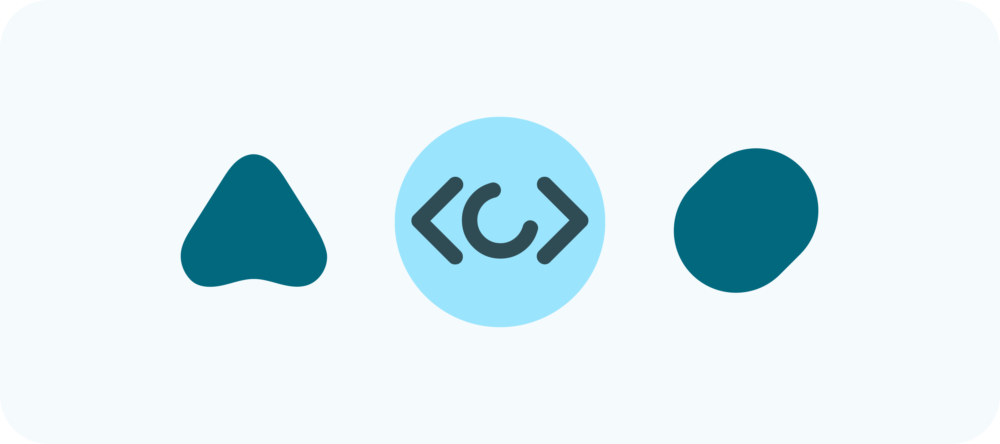

  
  <h1>D4vidDf</h1>
  
Multiplatform Developer & Tool Builder

---

### 👋 About Me

I'm a passionate developer focused on building tools that improve lives. I am a 25-year-old programmer. I have reduced mobility due to a rare neurological disease, and I can only program for about half an hour a day. My commitment to creating impactful software remains constant despite these constraints.

I am currently dedicating my time to **PillPal**, a free medication reminder app designed to help users stay on top of their health and not miss a dose.

---

### 💻 My Toolkit

As a multiplatform developer, I work with a variety of technologies. Here’s a breakdown of my toolkit:

| Core Languages | Frontend & Mobile | Backend & Cloud | Databases & Tools | Operating Systems |
|----------------|-------------------|-----------------|-------------------|-------------------|
| **Java** | **Flutter** | **.NET** | **Git** | **Windows** |
| **Kotlin** | **HTML5** | **Google Cloud** | **MySQL** | **Linux** |
| **Swift** | **CSS** | | **VS Code** | **macOS** |
| | **Jetpack Compose** | | **Visual Studio** | **iOS** |
| | | | **Android Studio** | **Android** |

---

### 🚀 Featured Project

  <h3>PillPal</h3>

*A free medication reminder app that helps users not miss a dose.*

I'm building this app to make a real difference in people's lives. You can check out the repository [here](https://github.com/D4vidDf/PillPal) and follow its progress.